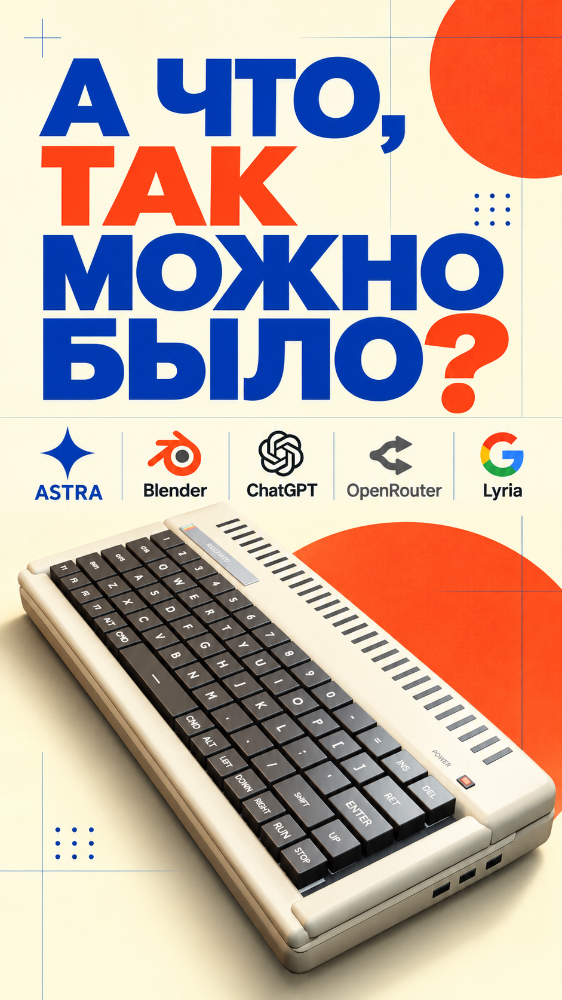

# RUDENKO AI VIDEO — Blender project and 24-second Reel



Готовый ролик: [смотреть / скачать MP4](video/RUDENKO_AI_VIDEO_PORTRAIT_1080x1920.mp4). Это вертикальный рендер 1080×1920, 24 FPS, 24 секунды, со звуком.

Я не был 3D-художником и хотел проверить, насколько далеко можно зайти с идеей, промптами и Blender. В папке `prompts/` лежит история моих заданий: первоначальный бриф, доработка сцены, брендирование и вертикальная версия. **Первый промпт описывает начало работы, а не обещает в один шаг получить этот финальный фильм.** Для точного повторения здесь есть готовая редактируемая сцена и звук.

## Что внутри

- `scene/RUDENKO_AI_VIDEO_PORTRAIT.blend` — редактируемая сцена Blender: компьютер, клавиши, камера, свет, анимация и надписи.
- `video/` — готовый ролик со звуком.
- `audio/MASTER_MIX.wav` — финальный микс для сборки нового рендера. Музыка уже готова; генерация и платные сервисы не нужны.
- `images/final_frame.png` — финальный кадр; `images/cover.png` — обложка.
- `prompts/` — оригинальные русскоязычные задания по этапам. Локальные пути автора заменены пояснением.
- `scripts/` — простые команды для рендера и сборки видео.

## Повторить у себя

Нужны Blender с поддержкой этой сцены (проект создан в Blender 5.1.2), Python 3 и FFmpeg. Сначала откройте `.blend` обычным способом и осмотрите сцену. Быстрое тестовое изображение финального кадра:

```bash
blender -b scene/RUDENKO_AI_VIDEO_PORTRAIT.blend --python scripts/render.py -- --preview
```

Оно появится в `output/preview.png`. Для полного пересчёта всех 576 кадров:

```bash
blender -b scene/RUDENKO_AI_VIDEO_PORTRAIT.blend --python scripts/render.py
bash scripts/assemble.sh
```

Готовый новый файл появится в `output/RUDENKO_AI_VIDEO_rebuilt.mp4`. Полный 3D-рендер может занять много часов и требует достаточно свободного места для PNG-кадров. Сборка использует готовый WAV и сохраняет длительность 24 секунды. Кодирование повторного рендера может немного отличаться от опубликованного MP4.

## Как это делали

Сначала я описал ретро-компьютер и драматургию клавиш простым текстом. Затем мы несколько раз уточняли формы, движение, камеру и бренд. Blender сохранил всю сцену редактируемой: клавиши в воздухе, посадка ENTER, обрушение, макропролёт и финальная печать. Для вертикальной версии камера и размещение отдельных объектов были поставлены заново внутри той же 3D-сцены. Музыка и эффекты уже сведены в приложенном файле. В этой публикации нет API-ключей, доступа к чужим сервисам или скрытой зависимости от моего компьютера.

Здесь переданы **файлы проекта**, а не веса модели ИИ. Можно открыть сцену, изучить настройки, изменить её и сделать свой рендер. Логотипы и названия сторонних сервисов в истории проекта принадлежат их владельцам.
